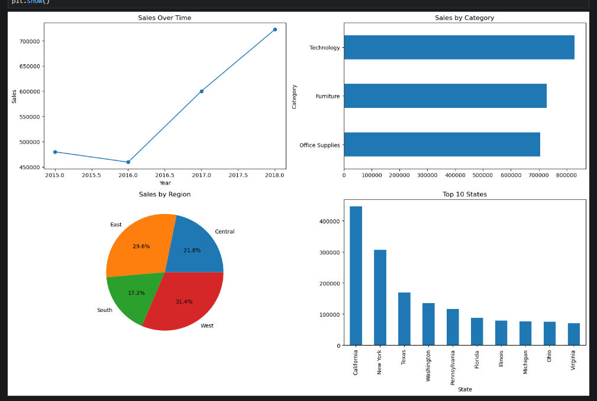

# Superstore Sales Analysis

A complete exploratory data analysis of a retail superstore dataset (9,800 orders, 2015–2018), built with Python and Pandas. The project cleans raw sales data, uncovers business insights, and visualizes key trends.

## Objective
Analyze retail sales data to identify top-performing categories, regional patterns, and growth trends that can guide business decisions.

## Key Insights
- **Total sales of $2.26M** across three product categories, led by Technology ($827K).
- **~50% sales growth** over four years, rising from $480K (2015) to $722K (2018).
- **Geographic concentration:** California and New York alone account for ~33% of total sales.
- **The Consumer segment** drives 51% of revenue.
- **The South region underperforms** and represents an opportunity for targeted marketing.

## Tools & Skills
- Python, Pandas (data cleaning & analysis)
- Matplotlib (data visualization)
- Data wrangling: handling missing values, date parsing, feature engineering

## Process
1. **Data Import** — loaded and inspected 9,800 records across 18 columns.
2. **Data Cleaning** — handled missing values, converted date columns, removed duplicates, engineered Year/Month features.
3. **Exploratory Analysis** — aggregated sales by category, region, state, segment, and time.
4. **Visualization** — produced a four-panel dashboard of key metrics.

## Visualizations

## Files
- `analysis.ipynb` — full analysis notebook
- `sales_analysis.png` — summary visualizations
