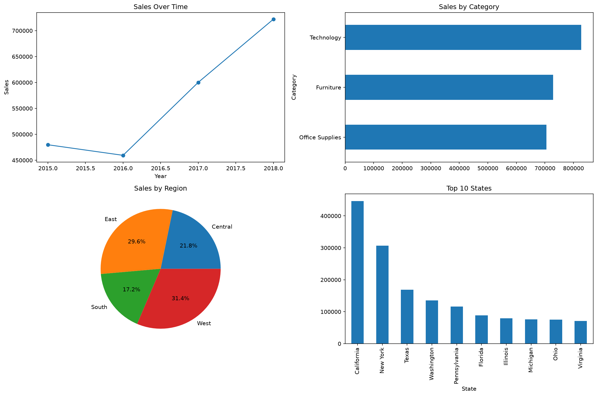

# 🛒 Superstore Sales Analysis


Exploratory analysis of **9,800 retail orders (2015–2018)** totaling **$2.26M in sales** — identifying top categories, regional gaps, and growth trends to guide business decisions.



## 🎯 Business Question
Where does the revenue come from, how is it growing, and where are the untapped opportunities?

## 🔍 Key Insights
- **$2.26M total sales**, led by **Technology ($827K)**.
- **~50% growth in four years** — from **$480K (2015)** to **$722K (2018)**.
- **Geographic concentration:** California and New York generate **~33%** of all sales.
- **Consumer segment** drives **51%** of revenue.
- **South region underperforms** compared with the other regions.

## 💡 Recommendations
1. **Grow the South region** with targeted marketing and promotions.
2. **Reduce dependence on California and New York** by expanding in other states.
3. **Prioritize Technology** — the highest-revenue category.
4. **Develop the Corporate and Home Office segments** to diversify revenue.

## 🛠️ Process
1. **Import** — 9,800 records × 18 columns
2. **Cleaning** — handled missing values, parsed dates, removed duplicates, engineered Year/Month features
3. **Analysis** — sales by category, region, state, segment, and time
4. **Visualization** — four-panel KPI dashboard

## 📁 Project Structure
```
├── data/
│   ├── train.csv              # raw dataset
│   └── superstore_clean.csv   # cleaned dataset (generated by the notebook)
├── analysis.ipynb             # full analysis notebook
├── sales_analysis.png         # dashboard
└── requirements.txt
```

## ▶️ How to Run
```bash
git clone https://github.com/iOsamah/superstore-sales-analysis.git
cd superstore-sales-analysis
pip install -r requirements.txt
jupyter notebook analysis.ipynb
```

## 📊 Dataset
[Superstore Sales Dataset](https://www.kaggle.com/datasets/rohitsahoo/sales-forecasting) — Kaggle.

---

**Osama Dhifallah Hamdi** · [LinkedIn](https://linkedin.com/in/osama0hamdi) · [GitHub](https://github.com/iOsamah)
